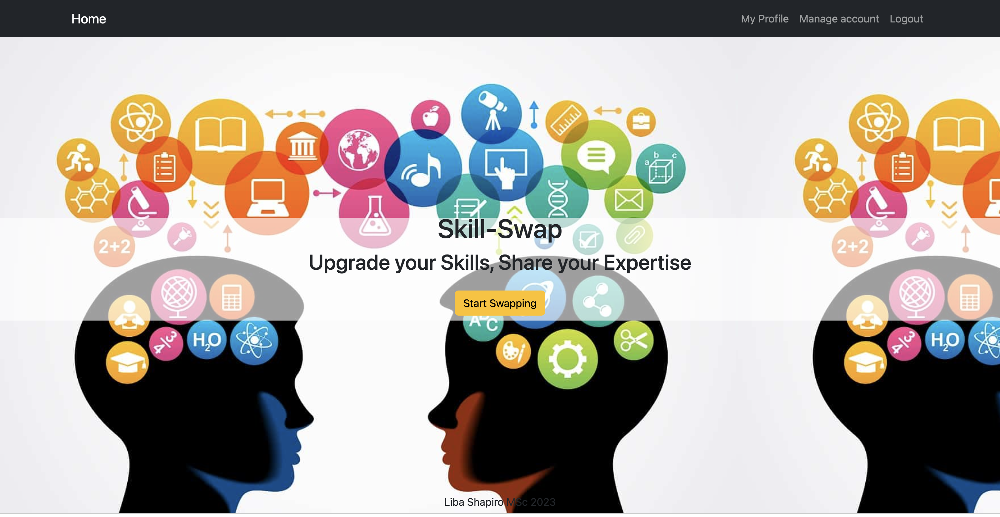
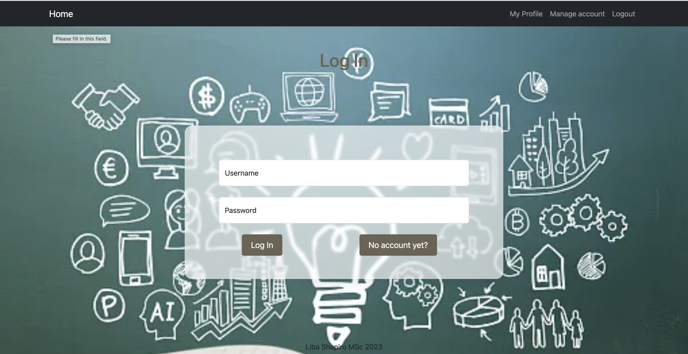
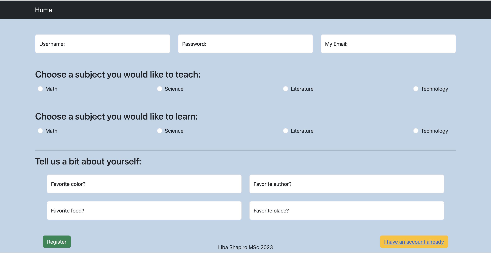
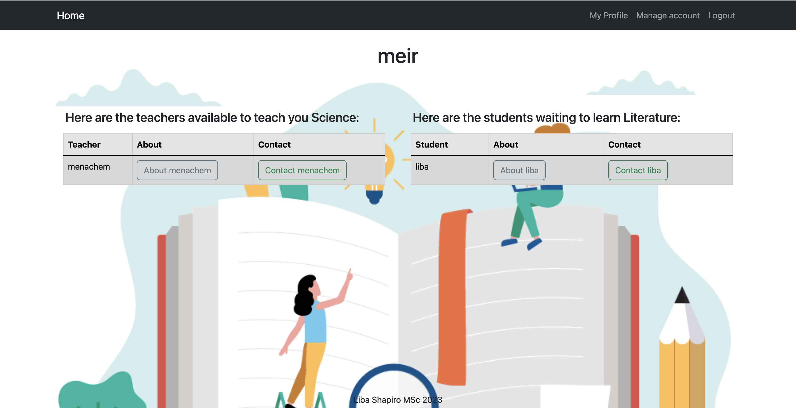
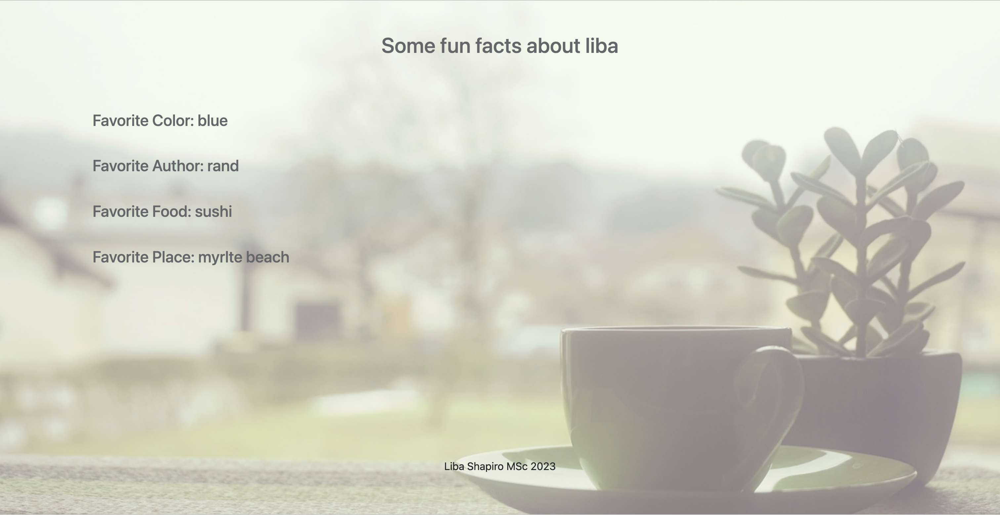

Skill Swap
Skill Swap is a mobile-first fullstack app that allows users to teach, learn and swap skills.

Architecture:  
Frontend: Next.js 13 as the frontend framework to build our web app.
Backend: Node.js to build the server-side of our app.
Database: PostgreSQL as the database management system.
 

Technologies Used:  

Next.js for server-side-rendering and Frontend development.
PostgreSQL
REST API
TypeScript / JavaScript
React
Node.js
Figma
 

Visual Design of App:

Landing page of Skill-Swap:
 

Login:
 

Registration:
 

Login:
 

Profile:
 

Preferences:
 

Setup Instructions:  

- git clone the Github repo to your local machine
- Install Next.js yarn add create-next-app
- Setup the database by downloading and installing PostgreSQL
- Create a user and a database
- Copy the .env.example file to a new file called .env (this will be ignored from Git)
- Replace the ##### with username, password and name of your database
- Install dotenv-cli with yarn add dotenv-cli
- Run the migrations with yarn migrate up
- Finally, start the server by running yarn dev
